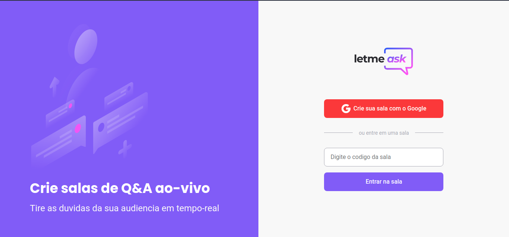

<h1 align="center">
  
</h1>
Letmeask e um app para gerenciar salas de perguntas e respostas, desenvolvido na 6 edição do NLW - Next Level Week proporcionado pela Rocketseat.
[Deploy](https://letmeask-nlw6-swart.vercel.app/)

## Tecnlogias ultilizadas

- React
- Sass
- Typescript
- Firebase

## Desafios do proximo nivel

- [x] Responsividade
- [ ] Tema Dark
- [x] PWA
- [x] Eslint & Prettier
- [x] Deploy

## Preview da responsividade

